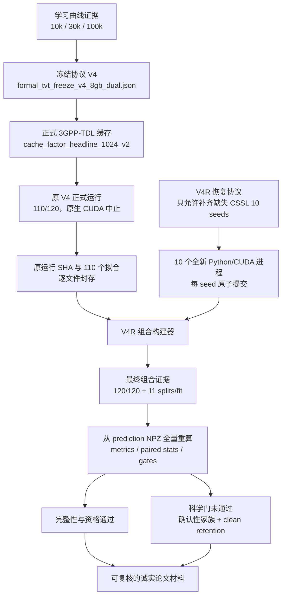

# TVT 支线外部 Agent 交接与证据链总索引

> 快照日期：2026-08-12（Asia/Shanghai）  
> 工作区：`D:\CNN信号调制识别\TVT支线\02_实验源码与证据\01_当前可复现主线`  
> 分支 / 当前提交：`main` / `603e1bf3417ae63928eda7e4c9b5ad632f6e5847`  
> 交接性质：本地、仿真、可复核的研究工程与证据索引；不是论文定稿，也不是硬件或外场验证报告。

## 0. 外部 Agent 先读：当前真实状态

TVT 正式实验已通过一次受控恢复形成 **120/120 个模型-随机种子拟合的完整组合证据**。最终应读取：

- `artifacts/tvt_v4r_headline_composite/`
- 组合 `run.json` 状态：`complete`
- 12 个模型 × 10 个算法随机种子 = 120 个拟合
- 每个拟合有 11 个 evaluation prediction bundle
- `formal_paper_evidence_eligible = true`
- `headline_eligible = true`
- 完整性校验：通过

但这不等于所有预注册科学假设均通过。最终科学门状态为：

- `scientific_evidence_passed = false`
- `submission_unlocked = false`
- 仅有两个失败原因：
  1. `confirmatory_family_gate_failed`
  2. `clean_retention_gate_failed`

因此，证据链完整且可用于诚实论文写作，但论文必须按“强干扰下的紧凑物理引导方法、有效增益与明确权衡”组织；不得写成“全场景全面领先”“所有机制获证”或“SOTA 已建立”。

原 V4 正式运行目录 `artifacts/tvt_headline_1024_10seed_v4_8gb_dual/` 因原生 CUDA host allocator 中止，只完成 110/120 个拟合，必须永久保留为 **interrupted source run**，不得修改成 `complete`。缺失的 10 个 CSSL 拟合由 V4R 隔离恢复补齐，最终组合证据显式记录：

```text
original_run_completion_claimed = false
composite_recovery_complete = true
```

## 1. 项目目标与范围

项目研究 VIMD-Net / `a5_vimd_full`：面向车辆多普勒、TDL 多径和结构化同频干扰条件的自动调制识别（AMC），通过物理对齐的时频表示分配、mask teacher 和多目标训练提高鲁棒性。

正式证据边界：

- 受控合成 AMC 仿真；
- 信道原语使用 MATLAB `nrTDLChannel`，按 3GPP TR 38.901 TDL profile 构建离线缓存；
- 训练、验证、测试 source sequence 隔离；
- 10 个算法随机种子；
- 配对、分层、层次 bootstrap，10,000 draws；
- 比较完整消融梯、CSSL-AMC 适配基线、MCLDNN 与 IQFormer-inspired 基线；
- 这是算法与仿真验证，不是完整 V2X 系统级合规、实测、外场、在轨或工程部署证据。

明确不在范围内：FPGA/SoC/SDR 板卡部署、HIL、实地 RF 测试、卫星测量、在轨验证。不得把仿真证据表述为 measured、onboard、field 或 operational evidence。

## 2. 可信证据链总图



信任顺序：

1. 冻结配置与 cache manifest；
2. 原 V4 的不可变 110-fit 源证据；
3. V4R recovery seal、状态和 10 个 worker manifests；
4. 最终 composite 的逐文件 inventory 与 seal；
5. 由 120 份预测包重算的 CSV、统计量和 release gate；
6. 最后才是论文文本、图表和叙述。

若论文文本与机器证据冲突，以第 1–5 层为准。

## 3. 单一最终证据入口

### 3.1 最终组合目录

`artifacts/tvt_v4r_headline_composite/`

主要文件：

| 文件 | 用途 | 当前 SHA-256 |
|---|---|---|
| `run.json` | 120 个拟合、环境、资格、结果及 provenance 的组合记录 | `dee361e195344db72959d2530732785049bb267011f4c75d67b68543988fec57` |
| `composite_seal.json` | 组合完成状态、原运行未冒充完成、科学门状态 | `b1e7354fd070e1bb1ceffda982bbbda2f3f7a8a96f91b4c7e191a9f1e9f48aee` |
| `recovery_inventory.json` | 原 110 + 恢复 10 的逐文件来源、SHA 和大小；完整物料账本 | `0f5592036c086a6fc83fb369ba40c82595fa2e8beba4a8cf16250af54c741133` |
| `v2_scientific_release_gate.json` | 从预测包独立推导的科学 gate 与失败原因 | `fd6d9017208f5a9cf55382de7e03647de39d93f85075590856fa45f93a9ddf6f` |
| `metrics.csv` | 12×10×11 = 1,320 行逐 seed、逐 regime 指标 | 以 inventory/seal 为准 |
| `seed_aggregates.csv` | 模型×regime 的 10-seed 汇总 | 以 inventory/seal 为准 |
| `paired_statistics.csv` | 全部冻结配对统计 | 以 inventory/seal 为准 |
| `headline_paired_statistics.csv` | 以 CSSL 为 reference 的 headline 配对统计 | 以 inventory/seal 为准 |
| `ablation_paired_statistics.csv` | 三项预注册确认性消融及联合同时置信区间 | `3a65474a18bb1850202d0872fa9dfbe1c23252e5477a6e112c231699ccaebabe` |
| `models/` | 120 个同构 fit 目录：result、checkpoint、predictions | 每文件 SHA 见 inventory |
| `manifests/` | 缓存、来源和组合相关 manifests | 每文件 SHA 见 inventory |

目录快照：1,642 个文件，约 725.8 MB。要核验“全部证据文件”时，不要人工枚举，以 `recovery_inventory.json` 的逐文件清单为唯一详尽索引。

### 3.2 一键只读校验

在仓库根目录执行：

```powershell
D:\Python\python.exe tvt_submission\build_v4r_composite.py --validate artifacts\tvt_v4r_headline_composite
```

期望核心结果：

```text
valid = true
result_count = 120
reasons = []
scientific_evidence_passed = false
submission_unlocked = false
```

`valid=true` 表示结构、哈希、来源和统计重推导有效；最后两项为 false 是真实的科学结论，不是文件损坏。

## 4. 冻结协议、数据与环境绑定

### 4.1 正式 V4 冻结

- 文件：`tvt_submission/configs/formal_tvt_freeze_v4_8gb_dual.json`
- SHA-256：`3b7076e3f6cf09f7d1b5e1d45d33989f8eb34510345349bb1683f6c6f52ec1aa`
- 正式 run ID：`tvt_headline_1024_10seed_v4_8gb_dual`
- batch size：16
- AMP：启用
- CUDA admission：至少 6,000 MiB free
- 声明 scheduler concurrency：2；实际高显存 CSSL 恢复为安全起见串行执行
- 正式训练规模：100,000 source sequences

V2、V3 冻结文件保留为历史协议，不得与 V4 结果混合：

- `tvt_submission/configs/formal_tvt_freeze_v2.json`
- `tvt_submission/configs/formal_tvt_freeze_v3_8gb.json`

V4 合同解释与 SHA/path 绑定在：

- `tvt_submission/formal_v2_contract.py`
- `tvt_submission/validate_formal_freeze_v2.py`

### 4.2 V4R 技术恢复冻结

- 文件：`tvt_submission/configs/formal_tvt_recovery_v4r_110plus10.json`
- SHA-256：`e88926f3c4d0958074524665b9543734fc89455d0b463a967ae70da382cbb916`
- 只允许模型：`cssl_amc_supervised_adaptation`
- 只允许 seeds：`17,29,43,71,101,131,173,211,257,307`
- 所有科学超参数、缓存、模型 factory、评估 splits 与 V4 一致
- 唯一明确技术稳定措施：训练 DataLoader `pin_memory=False`
- 每 seed 使用全新 OS Python / CUDA context；失败即停；无自适应 batch 或模型变更

技术恢复不把原 V4 篡改为完成；它产生独立 worker 证据，之后由专门的 composite schema 合并。

### 4.3 正式数据缓存

- 根目录：`standards/cache_factor_headline_1024_v2/`
- 目录快照：253 个文件，16,931,362,895 bytes（约 15.77 GiB）
- manifest：`standards/cache_factor_headline_1024_v2/manifest.json`
- manifest SHA-256：`47ca2c06d5433369b02210d45e7874e954353bfff657bfac43e70b3cc81bdd69`
- cache digest：`f2003d4bfb0895ed8c883c6432b82345999be64df3d9834d2bd9451dc0697d80`
- train：100,000 sources
- validation：2,000 sources
- 各正式 test regime：5,000 sources（clean-retention 分层统计按其 profile 子集重算）

缓存构建与协议：

- `standards/build_factor_cache.py`
- `standards/matlab/vimd_apply_nrtdl_batch.m`
- `docs/FACTOR_ISOLATED_CACHE_PROTOCOL.md`
- `src/vimd_amc/standards/cache.py`
- `src/vimd_amc/standards/nrtdl_matlab.py`

正式 11 个 evaluation splits：

```text
validation
id_test
hard_interference
unseen_jammer
unseen_speed
heldout_channel
combined_ood
clean_retention
adc_10bit_agc
adc_12bit_agc
per_emitter_sync
```

训练 split 为 `train`，不计入上述 11 个 prediction bundles。

### 4.4 学习曲线

- 证据：`artifacts/tvt_learning_curve_v4_8gb_dual/learning_curve_evidence.json`
- SHA-256：`1a9974b6b79b74db974f807d7e67c42ccfae6ad8fa940c6e953eada75bec9f20`
- 状态：complete
- 设备：CUDA
- 模型：`a0_backbone`, `a5_vimd_full`
- seeds：`17,29,43,71,101`
- source counts：10k、30k、100k
- formal scale：100k
- `posthoc_scale_selected=false`
- validation source IDs 跨规模一致
- source tree 跨规模不变
- 必需 epoch metrics 完整

对应缓存：

- `standards/cache_factor_learning_10k_1024_v2/`
- `standards/cache_factor_learning_30k_1024_v2/`
- 正式 100k 使用 `standards/cache_factor_headline_1024_v2/`

### 4.5 运行环境与受控源码

- GPU：NVIDIA GeForce RTX 5060 Ti 8GB
- Python：3.12.10
- PyTorch：2.12.1+cu130
- 最终 release-validator runtime：NumPy 2.5.0，SciPy 1.18.0
- 受控 source-tree profile：`tvt_v2_execution`
- 受控文件数：43
- source-tree aggregate digest：`2d1cbff1c2734d5232e1f482b0b158c15883c4d832775456751e0ca3204a3593`
- 120 个结果中 fallback count：0

每个受控文件的 SHA 位于最终 `run.json` 和 `recovery_inventory.json`，不要从当前 Git 工作树重新猜测历史执行版本。

## 5. 原 V4 中断、V4R 恢复和组合过程

### 5.1 原 V4 中断事实

- 原目录：`artifacts/tvt_headline_1024_10seed_v4_8gb_dual/`
- 原 `run.json` SHA-256：`fe7d302fee218b960594ad0ca181536cab7711357462154e575c8bcdf3daadfb`
- 完成：11 个模型 × 10 seeds = 110 fits
- 精确缺失：CSSL 10 seeds
- 中断原因：高显存 CSSL 阶段发生 native `CachingHostAllocator` abort
- 原目录：1,504 个文件，约 351.9 MB

不能直接用标准 runner 只跑 CSSL：正式 runner 对 reference、完整 Holm candidates 和消融族有强制一致性门，单模型 CLI 会 fail closed；绕过这些门或改 manifest 会破坏正式证据资格。

### 5.2 V4R 恢复实现

| 文件 | 职责 | 当前 SHA-256 |
|---|---|---|
| `tvt_submission/recovery_v4r_worker.py` | 单个 CSSL seed 的隔离 fit worker；验证绑定，输出 manifest 最后发布 | `fd21cafd19c96bd2213671b7ebc46c8d52d8625973688267d67587a516a8f1a1` |
| `tvt_submission/run_v4r_recovery.py` | 串行调度、GPU/RAM admission、断点安全跳过、staging 原子 rename | `9ff75ad7be58b7e7b1f37a89c4ff0eb0741a0e476da3d85ec29a24b4362c543d` |
| `tvt_submission/build_v4r_composite.py` | 验 110+10 来源，从 NPZ 重算统计，构造并验证独立 composite | `d8b526bb8d5791f8c7cd1b645b01b59debb4c3349c06967829eb6b6677d476f4` |

恢复根：`artifacts/tvt_v4r_cssl_recovery_workers/`

关键文件：

- `sealed_source_inventory.json`：执行前封存原 run、源码、配置和全部 110-fit 来源；
- `recovery_state.json`：状态 `complete`，10 seeds 全部完成，无 failed seed；
- `tvt_v4r_cssl_seed{seed}/worker_manifest.json`：每个恢复 fit 的 config/source/cache/源码和输出 SHA；
- 每个 worker 输出 `result.json`、checkpoint、11 个 `predictions_<split>.npz`。

恢复根快照：164 个文件，约 370.8 MB。

只读查看恢复状态：

```powershell
D:\Python\python.exe tvt_submission\run_v4r_recovery.py --status-only --python D:\Python\python.exe
```

### 5.3 组合构建的防污染规则

- 原 110 个 fit 与恢复 10 个 fit 均逐文件核验；
- 120 个结果严格按冻结模型顺序 × seed 顺序排列；
- checkpoint 路径在新 root 内保持可解析；
- metrics、seed aggregates、headline stats、confirmatory family、OOD/receiver gates 全部从 120 份 prediction NPZ 重算，不拼接旧 CSV；
- 构建写入 staging，完成后原子发布；
- composite schema 明示原 run interrupted，禁止伪装为单次无中断正式运行；
- 初次组合时发现并修复了两类工具层问题：旧通用消融默认仅 5 seeds，以及 inventory 中 pseudo-materialized records；修复后重新绑定 V4 10-seed/3-contrast 合同并重推导协议；训练、checkpoint 和 prediction artifacts 未修改。

不要再次执行 `--build` 覆盖现有 composite。通常只运行 `--validate`；若要创建新版本，使用新目录、新 schema/ID，并先封存现有目录。

## 6. 模型、种子与实验矩阵

正式模型（12）：

| ID | 角色 |
|---|---|
| `a0_backbone` | 共享 backbone 基线 |
| `a1_single_mask` | 单 mask 消融 |
| `a2_tri_no_teacher` | 三路、无 teacher |
| `a3_tri_teacher` | 三路 + margin teacher |
| `a3p_tri_proportional_teacher` | naive proportional teacher 对照 |
| `a4_tri_teacher_mtl` | teacher + multi-task 变体 |
| `a5_vimd_full` | 提议的完整 VIMD 方法 |
| `a6_dual_full` | 双路完整目标对照 |
| `a7_vimd_no_residual` | 无 residual 消融 |
| `cssl_amc_supervised_adaptation` | CSSL-AMC 监督适配 reference |
| `mcldnn_reimplementation` | MCLDNN 文献基线重实现 |
| `iqformer_inspired` | IQFormer-inspired 文献基线 |

算法随机种子（10）：

```text
17, 29, 43, 71, 101, 131, 173, 211, 257, 307
```

主训练设置：30 epochs 上限、batch 16、learning rate 3e-4、weight decay 0.01、patience 8、AMP、输入长度 1024；其余精确模型和 schedule 参数以 V4 freeze 与 `run.json` 为准。

主要 runner：

- `experiments/run_standard_experiment.py`
- `experiments/run_learning_curve_v2.py`
- `experiments/run_formal_tvt_v2.py`
- `src/vimd_amc/training.py`
- `src/vimd_amc/evaluation.py`
- `src/vimd_amc/metrics.py`
- `src/vimd_amc/models/`

## 7. 最终定量结果

### 7.1 三项预注册确认性消融

主要指标：`hard_interference` macro-F1，A5 与对应 reference 的配对差；10 seeds、5,000 test-source clusters、10,000-draw joint hierarchical paired bootstrap；三项使用 simultaneous 95% CI。

| Contrast | 增益 | simultaneous 95% CI | 结论 |
|---|---:|---:|---|
| A5 vs A0，完整方法效应 | +4.571 pp | [+3.655, +5.488] pp | 通过；统计为正且超过预注册实质阈值 |
| A3 vs A3p，margin teacher vs proportional teacher | +0.159 pp | [-0.757, +1.076] pp | 不通过；证据不确定 |
| A5 vs A6，三路 vs 双路 | +0.444 pp | [-0.472, +1.361] pp | 不通过；证据不确定 |

三项必须共同通过，故 confirmatory family gate 失败。允许声称“完整方法相对共享 backbone 有稳定正增益”；不允许声称 margin teacher 形式或第三条 route 已被单独确认。

### 7.2 A5 相对 CSSL reference 的 headline 差异

均为 macro-F1 的 candidate-minus-reference，括号为分层配对 95% CI：

| Regime | A5 − CSSL | 95% CI | 解释 |
|---|---:|---:|---|
| ID | +4.962 pp | [+3.776, +6.126] pp | 明确正增益 |
| Hard interference | +4.911 pp | [+3.781, +6.072] pp | 明确正增益 |
| Held-out channel | +1.131 pp | [+0.011, +2.298] pp | 小幅正增益，贴近零边界 |
| Unseen speed | +1.536 pp | [+0.450, +2.644] pp | 正增益 |
| Unseen jammer | -4.142 pp | [-5.204, -3.080] pp | 明确退化 |
| Combined OOD | -4.118 pp | [-5.288, -2.958] pp | 明确退化 |
| Clean retention | -9.693 pp | [-10.562, -8.833] pp | 显著退化，主发布阻断 |

### 7.3 Clean-retention 预注册分层门

| 分层 | A5 − CSSL | 95% CI | 结果 |
|---|---:|---:|---|
| seen profiles A/C/D | -9.331 pp | [-10.416, -8.247] pp | 失败 |
| held profiles B/E | -10.186 pp | [-11.498, -8.799] pp | 失败 |

总体 clean-retention macro-F1：A5 `0.500503`，CSSL `0.597437`，差 `-0.096933`。不能隐藏这一代价，也不能将其降格为“轻微退化”。

### 7.4 A5 相对 A0 的 OOD / receiver robustness

冻结的 6 个轴均完整且通过其 opportunity/non-inferiority gate：

| 轴 | A5 − A0 macro-F1 |
|---|---:|
| unseen jammer | +3.569 pp |
| unseen speed | +4.252 pp |
| held-out channel | +3.622 pp |
| ADC 10-bit + AGC | +4.316 pp |
| ADC 12-bit + AGC | +4.742 pp |
| per-emitter synchronization | +4.234 pp |

这支持“相对共享 backbone 的鲁棒性增益”，不支持“相对所有强基线全面领先”。

### 7.5 关键绝对 macro-F1

| Model | ID | Hard | Unseen jammer | Unseen speed | Held-out | Combined OOD | Clean |
|---|---:|---:|---:|---:|---:|---:|---:|
| A0 | 0.5102 | 0.3949 | 0.4195 | 0.4499 | 0.4574 | 0.4157 | 0.4705 |
| A5 VIMD | 0.5654 | 0.4406 | 0.4552 | 0.4925 | 0.4936 | 0.4525 | 0.5005 |
| CSSL | 0.5158 | 0.3915 | 0.4966 | 0.4771 | 0.4823 | 0.4937 | 0.5974 |
| MCLDNN | 0.6439 | 0.4599 | 0.5868 | 0.5852 | 0.5711 | 0.5908 | 0.6414 |
| IQFormer-inspired | 0.6880 | 0.4872 | 0.6067 | 0.6187 | 0.6061 | 0.6145 | 0.6919 |

IQFormer-inspired 在这些主要绝对指标上总体第一，MCLDNN 通常第二。A5 的合理定位是小模型/低计算预算下的结构化干扰鲁棒性与可审计机制设计，而非绝对精度 SOTA。

### 7.6 复杂度

| Model | 参数量 | MACs | CUDA p50 latency | state dict |
|---|---:|---:|---:|---:|
| A0 | 8,458 | 6.275 M | ~0.729 ms | 以结果文件为准 |
| A5 VIMD | 39,500 | 41.799 M | ~3.172 ms | ~0.180 MB |
| MCLDNN | 406,070 | 398.216 M | ~3.789 ms | ~1.556 MB |
| IQFormer-inspired | 354,984 | 355.574 M | ~4.181 ms | ~1.419 MB |
| CSSL | 8,631,948 | 155.329 M | ~0.786 ms | ~32.944 MB |

延迟仅代表本机软件栈的 CUDA 推理测量，不得外推成嵌入式部署、功耗或实时系统结论。

### 7.7 机制方向检验

预注册假设认为 jammer spectral occupancy 越高，A5−A0 gain 应非递增/呈负 Spearman 相关。实际结果：

- Spearman rho：`+0.7142857`
- 预测方向：negative
- exact one-sided permutation p：`0.9486111`
- strict occupancy inversions：11
- `direction_supported=false`
- `positive_mechanism_claim_eligible=false`

此门预注册为非阻断门，所以不影响 artifact 完整性，但必须明确写成“不支持该单调机制解释”；不能选择性展示 family gain 后继续声称 occupancy 假设成立。

## 8. 科学结论强度与可发表边界

### 可由当前证据直接支持

- A5 相对共享 backbone 在 hard interference 上获得约 +4.57 pp macro-F1，联合同时 CI 严格为正；
- A5 相对 CSSL 在 ID、hard interference、held-out channel、unseen speed 上有配对正增益；
- A5 相对 A0 在 6 个冻结 OOD/receiver axes 上均通过；
- A5 远小于 MCLDNN / IQFormer-inspired，呈现可量化的精度—复杂度折中；
- 整套数据、源码、环境、训练、预测、统计和恢复链可机器复核。

### 当前证据明确不支持

- 不支持 A5 在全部场景全面优于 CSSL；
- 不支持 A5 在绝对 macro-F1 上优于 MCLDNN 或 IQFormer-inspired；
- 不支持 clean-signal retention 合格；
- 不支持 margin teacher 比 proportional teacher 确定更优；
- 不支持三路结构比双路结构确定更优；
- 不支持 jammer occupancy 单调机制；
- 不支持实测、SDR、板卡、外场、在轨、完整 V2X 合规或工程部署主张。

### 对“二区高水平论文”的谨慎评估

实验矩阵、10-seed 配对统计、冻结协议、独立来源缓存、基线覆盖和恢复审计的证据工程强度较高，足以形成一篇诚实、可复核的完整论文。是否达到具体二区期刊标准仍取决于选刊、方法新颖性阐释、与最新工作的定位及稿件表达，不能由本地实验自动保证。

最有希望的叙事是：

> 一种紧凑、物理引导、面向结构化强干扰的 AMC 表示分配方法；它相对同 backbone 和特定 CSSL reference 在若干核心场景取得稳定增益，同时呈现可测的 clean/unseen-jammer 泛化代价；预注册消融使有效主效应与未获支持的细粒度机制得到清晰区分。

若目标期刊要求“所有预注册 gate 通过”或“绝对性能优于强基线”，当前结果不足；不得通过改阈值、删对比或重定义 primary outcome 解决。

## 9. 已完成的工作

1. 建立 factor-isolated 1024-sample 数据缓存与 source-disjoint 协议。
2. 接入 MATLAB `nrTDLChannel` 的 TDL channel primitive 并记录 provenance。
3. 实现 A0–A7 消融梯、CSSL supervised adaptation、MCLDNN 与 IQFormer-inspired 对照。
4. 实现训练、预测、复杂度、校准、mask/teacher/机制等机器可读指标。
5. 冻结 V2 统计协议，并增加 V3/V4 的 8GB GPU 执行 amendment；V4 为 batch 16、AMP、6,000 MiB admission。
6. 完成 10k/30k/100k 学习曲线，正式规模事先固定为 100k。
7. 启动 V4 12×10 正式训练，并保留 native abort 后的 110-fit 原始证据。
8. 设计 V4R recovery schema，避免篡改原 run 或绕过正式 runner gate。
9. 完成缺失的 10 个 CSSL seeds，使用 fresh process、原子提交和逐文件哈希。
10. 构建 120-fit composite，并从 1,320 个 regime-level 结果对应的 prediction bundles 全量重算统计。
11. 实现 composite validator、recovery inventory、seal 和专用测试。
12. 修复 composite 统计重推导中的旧 5-seed 默认绑定和 inventory materialization 问题；最终绑定 V4 10-seed/3-contrast 协议。
13. 完成确认性家族、headline、clean retention、OOD/receiver、occupancy 和复杂度分析。
14. 明确记录所有正面、负面和不确定结果；科学发布门保持 fail-closed。

## 10. 测试与复核入口

### 10.1 最近一次证据链测试

```powershell
D:\Python\python.exe -m pytest `
  tests\test_v4r_composite_recovery.py `
  tests\test_formal_v2_protocol.py `
  tests\test_v2_execution_integrity.py `
  tests\test_v2_paper_release.py -q
```

最近记录：`35 passed, 45 subtests passed`。

恢复专项测试：

- `tests/test_recovery_v4r_worker.py`
- `tests/test_v4r_recovery_scheduler.py`
- `tests/test_v4r_composite_recovery.py`

### 10.2 关键 validator

- `tvt_submission/validate_formal_freeze_v2.py`
- `tvt_submission/validate_v2_release.py`
- `tvt_submission/validate_v2_paper_release.py`
- `tvt_submission/validate_paper_build.py`
- `tvt_submission/build_v4r_composite.py --validate ...`

建议外部 Agent 接手后的第一组只读动作：

```powershell
Set-Location -LiteralPath 'D:\CNN信号调制识别\TVT支线\02_实验源码与证据\01_当前可复现主线'

Get-FileHash -Algorithm SHA256 `
  tvt_submission\configs\formal_tvt_freeze_v4_8gb_dual.json, `
  tvt_submission\configs\formal_tvt_recovery_v4r_110plus10.json, `
  artifacts\tvt_headline_1024_10seed_v4_8gb_dual\run.json, `
  artifacts\tvt_v4r_headline_composite\run.json, `
  artifacts\tvt_v4r_headline_composite\composite_seal.json

D:\Python\python.exe tvt_submission\run_v4r_recovery.py `
  --status-only --python D:\Python\python.exe

D:\Python\python.exe tvt_submission\build_v4r_composite.py `
  --validate artifacts\tvt_v4r_headline_composite
```

## 11. 论文与文档状态

### 11.1 当前论文文件仍是旧占位稿

- `paper/main.tex`
- `paper/results_auto.tex`
- `paper/SUBMISSION_READINESS.md`
- `paper/EVIDENCE_LEDGER.md`

这些文件仍保留 2026-07-29 左右的 internal-review / pending-result 叙述，`results_auto.tex` 仍含 `--` 占位，尚未吸收 V4R composite。它们不是当前结果的可信摘要，也没有当前可提交 PDF。

不得直接运行旧的“正向结果 promotion”并假设 release 会通过，因为当前科学 gate 真实失败。下一版论文需要支持“诚实失败/权衡报告”的宏生成和 release 语义，不能把 `submission_unlocked=false` 隐藏掉。

### 11.2 关键设计与审计文档

- `docs/TVT_V2_PROSPECTIVE_STATISTICAL_JUSTIFICATION.md`：预先统计论证；
- `docs/TVT_V3_8GB_EXECUTION_AMENDMENT_2026-08-02.md`：8GB 执行历史 amendment；
- `docs/FACTOR_ISOLATED_CACHE_PROTOCOL.md`：缓存与隔离协议；
- `docs/TVT_V2_M4_M7_PROTOCOL.md`：机制/里程碑协议；
- `docs/TEACHER_FUNCTION_EVIDENCE.md`：teacher 功能证据边界；
- `docs/FINAL_TVT_REVIEWER_ATTACK_AUDIT.md`：审稿人攻击面审计；
- `docs/TVT_REVIEW_RESPONSE_MATRIX.md`：问题—证据—响应矩阵；
- `docs/TVT_EVIDENCE_CLOSURE_DELIVERY_2026-07-29.md`：较早交付快照，仅作历史参考。

上述旧文档若与最终 composite 冲突，以最终机器证据为准；不要为了更新措辞修改 frozen/sealed artifacts，应在新论文或新的非冻结 governing document 中更正。

## 12. 外部 Agent 的后续任务清单

### P0：先保持证据不变

- 运行 composite `--validate` 并保存输出；
- 读取 `composite_seal.json`、`v2_scientific_release_gate.json` 和 `recovery_inventory.json`；
- 确认原 V4 `run.json` SHA 与 recovery config SHA；
- 不重训、不改阈值、不重建既有 composite。

### P1：建立诚实论文数据层

- 新建“honest-result / trade-off”论文宏生成器或新 manifest；
- 从最终 CSV/JSON 自动生成所有表格和数字，禁止手抄；
- 同时输出正结果、失败 gate、负增益和不确定消融；
- 生成主结果、复杂度、学习曲线、确认性家族、clean-retention、OOD/receiver 图表；
- 给每一处论文数字保留 source artifact、row selector 和 SHA provenance。

### P2：重写论文

- 重写摘要、贡献、结果、讨论、局限性和结论；
- 将贡献收敛到“紧凑方法 + backbone-relative robustness + 严格审计”；
- 对 IQFormer/MCLDNN 的绝对优势作正面讨论；
- 明确 CSSL 上的 mixed result；
- 将 clean-retention 和 unseen-jammer/combined-OOD 退化写入核心结果，不放到难以发现的附录；
- 将未获支持的 teacher/tri-route/occupancy 假设写成不确定或反证结果；
- 保持 simulation-only 术语。

### P3：发布与复核

- 为当前“科学门未全过但允许诚实成稿”的论文路径定义独立、不可与正向 release 混淆的审计 schema；
- 编译 LaTeX，检查所有 `--`、TODO、旧 V3 文案和 pending-result 文案；
- 运行纸面数字反查、图表 hash、引用和匿名化检查；
- 最后再由人类作者决定选刊、作者信息、基金与披露。

### 不应自动执行的任务

- 不做补种子、挑 seed 或换 primary metric 来追求 gate 通过；
- 不调低 clean-retention 阈值；
- 不删除失败消融或较强基线；
- 不把 V4R 描述成原 V4 从未中断；
- 不把新的探索结果混入冻结确认性家族；
- 不以实测/部署为新 blocker，也不虚构相关证据。

## 13. 工作树与操作安全

当前仓库是 dirty worktree，本索引创建前约有 75 个 `git status --short` 条目。它们包含用户和既有 Agent 的未提交工作。外部 Agent 必须：

- 不执行 `git reset --hard`、`git checkout -- .`、`git clean` 或批量覆盖；
- 不把未提交文件视为可删除临时文件；
- 修改前先 `git status --short` 和 `git diff -- <target>`；
- 尽量只新建论文生成层文件，避免触碰 frozen configs、原 V4、workers 和 composite；
- 若必须改变 validator/论文 release 语义，新增 schema/version 并保留旧路径可复核。

当前 commit 仅用于定位代码基线；真正的执行 provenance 由 source-tree aggregate digest 和逐文件 inventory 绑定，不应仅依赖 Git HEAD。

## 14. 快速事实表

| 项目 | 值 |
|---|---|
| 最终可信目录 | `artifacts/tvt_v4r_headline_composite/` |
| 正式 run ID | `tvt_headline_1024_10seed_v4_8gb_dual` |
| 模型 × seeds | 12 × 10 |
| 完整 fits | 120/120 |
| evaluation splits / fit | 11 |
| metrics rows | 1,320 |
| 正式缓存 | 100k train，1024 samples |
| 统计 draws | 10,000 |
| 完整性 validator | 通过 |
| formal/headline eligibility | 通过 |
| scientific submission gate | 未通过 |
| 失败 gate | confirmatory family；clean retention |
| A5 vs A0 hard macro-F1 | +4.571 pp，simultaneous CI [+3.655,+5.488] |
| A5 vs CSSL hard macro-F1 | +4.911 pp，CI [+3.781,+6.072] |
| A5 vs CSSL clean macro-F1 | -9.693 pp，CI [-10.562,-8.833] |
| 机制 occupancy 方向 | 不支持，rho=+0.714，one-sided p=0.949 |
| 原 V4 | 110/120 后中断，保持不可变 |
| V4R | 10/10 恢复完成，原子封存 |
| 当前论文 | 旧占位稿，尚未更新/编译为当前成稿 |

## 15. 交接判定

外部 Agent 可以把“训练与正式统计证据生成”视为完成，把“论文数据层、诚实叙述重写、图表、LaTeX 编译与最终投稿审计”视为剩余主线。

最重要的判断是：**项目已经回到一条可成稿、可复核的轨道，但不是一条所有预注册结论均成功的轨道。** 正确交付是忠实呈现强主效应、轻量化价值、强基线差距、clean-retention 代价与未获支持机制，而不是继续消耗计算资源追求事后改写的成功结论。

