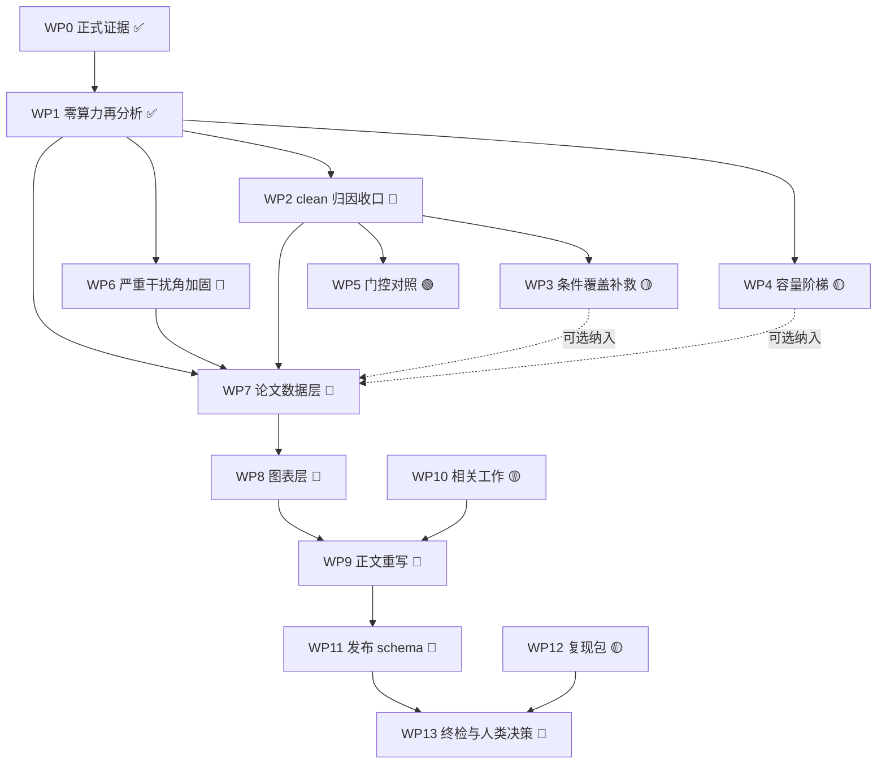

# TVT 支线多 Agent 协作工作分解大纲

> 版本：v2.4 ｜ 更新日期：2026-08-18（Asia/Shanghai）｜ v2.4 变更：WP5 H2-G 10-seed 负对照完成并接入稿件、数据层与复现审计  
> 适用范围：`D:\CNN信号调制识别\TVT支线\02_实验源码与证据\01_当前可复现主线`  
> 上游文档：`TVT_EXTERNAL_AGENT_HANDOFF_INDEX.md`（证据链总索引，仍然有效）、`analysis_zero_compute/RESULTS.md`（零算力再分析结果）  
> 本文件定位：**多个 agent 并行接手时的统一工作分解与判定标准**。它不替代交接索引，也不改变任何冻结证据；冲突时以机器证据 > 交接索引 > 本文件 > 论文文本为序。

---

## 0. 一句话结论

从当前状态到"强证据、强可辩护"的 TVT 稿件，共 14 个工作包；**14 个技术工作包均已闭环**：

| 层 | 工作包 | 状态 | 是否需要 GPU | 是否阻塞投稿 |
|---|---|---|---|---|
| L0 证据基线 | WP0, WP1 | ✅ 完成 | — | — |
| L1 证据加固 | WP2, WP3, WP4, WP5, WP6 | ✅ 全部完成（含 H2-F2 与 H2-G） | WP2–WP5 已完成 | WP5 为负对照，不改变已封存主门 |
| L2 论文构建 | WP7, WP8, WP9, WP10 | ✅ 全部技术完成 | 否 | — |
| L3 发布审计 | WP11, WP12, WP13 | ✅ 全部技术完成；WP13 人类签署待办 | 否 | 作者事实与签署阻塞实际上传 |

**最短诚实成稿和轻量审计交付的技术路径均已闭环**；技术上仅余整合后复编译与复现包重建核验。实际上传仍由 WP13 的人类作者事实与签署阻塞。WP5 不改写已封存门状态。

零算力部分已全部做完：A1–A14 共 14 项分析、36 个 CSV、IEEE 图表层 6 张；Tier-2/容量/门控负对照结果已接入同一可追溯数据层。

必须先说清楚：没有任何工作包能"保证录用"。可控的是证据强度与表述可辩护性；选刊与评审结果由人类作者与审稿人决定。

---

## 1. 当前状态快照

**已固化（不得修改）**

- 120/120 拟合、11 个 evaluation split、1,320 行 regime 级指标，完整性校验通过；
- 科学门**未通过**：`scientific_evidence_passed=false`、`submission_unlocked=false`；失败门为 `confirmatory_family_gate_failed`、`clean_retention_gate_failed`；
- 原 V4 中断证据与 V4R 恢复链逐文件封存。

**新增（探索性，零算力，2026-08-12）**

- 严重干扰角：SIR = −15 dB 上 A5 相对 MCLDNN **+9.74 pp** [+7.56, +12.15]、相对 IQFormer **+10.46 pp** [+6.93, +14.14]；
- clean-retention 的稳定坍塌集中在 QPSK/16QAM/64QAM，且 **A0–A7 紧凑谱域家族同样坍塌**，非 VIMD 机制引入；
- 按训练实际使用的两个 view 重算：PI2BPSK、8PSK、256QAM、CPFSK 四类见过无干扰训练窗，其余 6/10 类的无干扰条件为 OOD；旧 2/10 口径只看了 view1，现已撤回；
- 决策互补：A5+IQFormer 融合 +4.71 pp，同架构双种子集成对照仅 +1.49 pp；
- 缓存混合律 `x = AGC(clean+jammer+noise+receiver_artifact)` 已逐窗验证（最大相对误差 2.3e−7）；
- 首轮 Tier-2 探针（`tier2_clean_probe_v1`）因去干扰后未重归一化而作废；修正 v2 已完成，A5 在 6 个单元中 5 个低于阈值、1 个临界越线，记为"阈值边界、偏向表示受限"。

**整合状态（2026-08-18）**

- `paper/main.tex` 已按占用率--SIR 包络主轴重写，并显式纳入确认性失败门、clean 边界、Tier-2 sidecar 修复和容量阶梯；
- `paper_data_layer` 已扩展至 229 键，所有 Tier-2 数字（含 H2-G 对比与门值分布）保留 `exploratory` 类别；
- `output/pdf/tvt_operating_envelope_integration.pdf` 已编译为 7 页 IEEE 双栏稿并完成逐页视觉检查；
- `tvt_submission/validate_honest_paper_release.py` 已通过，报告固定保留 `submission_unlocked=false`；
- WP10 已生成 2024--2026 定位更新并把三篇 2026 记录接入正文；WP12 已重建为 1.86 MB、171 文件且哈希校验通过的 reviewer bundle；WP13 已生成 TVT 当前规则绑定的人类签署门；
- WP5 H2-G 10-seed 已完成：相对 A5 clean −0.30 pp [−0.66, +0.08]、hard −0.18 pp [−0.72, +0.35]；$g$ 在 clean/hard 分别为 99.994%/99.991%，故为公开的无修复负对照，而非已验证的成功 clean 回退机制；人类作者/单位/基金/冲突/AI 与专利声明仍不得代签。

---

## 1.5 叙事主线（已定，所有 agent 按此写作）

经五条候选叙事的实证比较（详见 `docs/TVT_REPOSITIONING_AND_CLAIM_LADDER.md` §0.5），确定主线为 **占用率索引的工作区包络（N1）**。决定性证据是 A14：

```
gain(A5 − IQFormer) [pp] = −16.60 + 11.39 · occupancy − 0.666 · SIR(dB)
gain(A5 − MCLDNN)   [pp] = −14.28 + 13.93 · occupancy − 0.504 · SIR(dB)
```

两个系数的 bootstrap 95% CI 均不含零。仅用 `id_test` + `hard_interference` 的 32 个单元拟合，在 5 个未见 regime 的 81 个单元上外推：**符号一致率 97.5%（vs MCLDNN 95.1%）**，Pearson r = 0.694，RMSE 6.2 pp。留出预测覆盖 held-out 干扰族（实测 −16.05 / 预测 −13.66 pp）与无干扰条件（−19.14 / −17.08 pp）。

对写作的三条硬约束：

1. **退化不再单独成节**。unseen_jammer、combined_ood、clean_retention 的退化必须作为包络律在低占用处的取值来呈现，并引用留出预测值；
2. **主结果表不得只给 marginal 平均**。跨工作区平均会把两个相反区域混掉，必须同时给出 SIR 分辨结果；
3. **break-even 占用率表进正文**（`a14_break_even_occupancy.csv`）：vs IQFormer 在 SIR −15/−10 dB 需 0.58/0.87，vs MCLDNN 需 0.48/0.66；SIR 高于约 −7 dB 无可达占用率。这是审稿人最可能引用的一张表。

被降级为支撑性主张的四条：Pareto 前沿（C6）、互补融合（C5）、条件迁移基准性质（C7）、严重干扰角（C1，作为包络律的一个推论）。它们仍然全部写入，但不作为组织全文的主轴。

---

## 2. 全局协作约定（所有 agent 必须遵守）

### 2.1 证据分级（每个数字必须带标签）

| 级别 | 含义 | 可用于 |
|---|---|---|
| `sealed_confirmatory` | V4/V4R 冻结协议内的预注册结果 | 主结果、确认性主张 |
| `sealed_descriptive` | 冻结产物中的描述性量（复杂度、校准等） | 主结果，须标注非确认性 |
| `exploratory_zero_compute` | 对封存预测的再分析（`analysis_zero_compute/`） | 结果与讨论，须标注 exploratory |
| `exploratory_tier2` | 新训练/新变体（Tier-2） | 单列小节，禁止与正式表混排 |
| `audit` | 溯源、校验、审计 | 附录与复现说明 |

**跨级别混排 = 阻断性错误。**

### 2.2 只读锁定清单（任何 agent 不得写入）

```
artifacts/tvt_v4r_headline_composite/
artifacts/tvt_headline_1024_10seed_v4_8gb_dual/
artifacts/tvt_v4r_cssl_recovery_workers/
artifacts/tvt_learning_curve_*/
standards/cache_factor_*/
tvt_submission/configs/formal_tvt_freeze_*.json
tvt_submission/configs/formal_tvt_recovery_*.json
```

开工前与收工后各跑一次哈希抽查（见 §6.1）。

### 2.3 并发规则

- 每个 WP 只写自己的产物目录，见各 WP 的"产物"字段；
- 跨 WP 需要的数据一律通过 CSV/JSON 传递，不共享内存状态、不互相 import 私有函数；
- 同一时刻**只允许一个 agent 占用 GPU**；GPU 类 WP 之间串行；
- `git`：禁止 `reset --hard` / `checkout -- .` / `clean`；只新增文件，修改既有文件前先 `git diff -- <file>`；
- 仓库当前为 dirty worktree（约 49 个已修改的 tracked 文件为历史遗留），**不要试图清理**。

### 2.4 命名

- 新运行目录：`artifacts/tier2_<主题>_v<N>/`；
- 新分析目录：`analysis_<主题>/outputs/{csv,figures}/`；
- 每个产物目录必须有 `provenance.json`（输入 SHA、产物 SHA、环境、证据级别）。

---

## 3. 工作包定义

### L0 证据基线

#### WP0 — 正式训练与统计证据 ✅ 已完成

- 产物：`artifacts/tvt_v4r_headline_composite/`（120 fits，1,642 文件，约 725.8 MB）
- 状态：complete；科学门 fail-closed
- 后续动作：**只读校验**，不重建。

#### WP1 — 零算力再分析 ✅ 已完成

- 产物：`analysis_zero_compute/`（14 个分析脚本、36 个 CSV、12 组图、`outputs/provenance.json`）
- 自校验：4 个 sealed headline 数字逐位重现（差 < 1e-9）
- 结论入口：`analysis_zero_compute/RESULTS.md`；对外叙事：`docs/TVT_REPOSITIONING_AND_CLAIM_LADDER.md`
- 分析清单：A1 SNR/SIR 曲线、A1b 工作区图、A2 分层、A3/A3b clean 解剖与家族扫描、A4 校准与选择性预测、A5 互补融合、A6 机制中介、A7 样本效率、A8 Pareto/TOST、A9 条件覆盖、A10 混合律审计、A11 严重角加固、A12 效应分辨力、**A13 条件迁移分类、A14 包络律与外推验证**

---

### L1 证据加固（决定"强"还是"够用"）

#### WP2 — clean-retention 归因收口 ✅ 已完成

| 项 | 内容 |
|---|---|
| 目标 | 把"clean-retention 失败"从"方法缺陷"收口为"训练条件覆盖 + 表示能力"的可证伪结论 |
| 输入 | `a9_condition_coverage.csv`、`a10_counterfactual_check_summary.json`、封存 checkpoint |
| 动作 | 已跑 `tier2_gpu/clean_probe_v2.py` 两种设计 × {A5, A0, CSSL, MCLDNN, IQFormer} × seeds {17,29,43} |
| 判定 | MLP 探针在 QPSK/16QAM/64QAM 的 F1 均值 > 0.25 → `information_present_head_limited`；否则 `representation_limited`；两种设计结论必须一致 |
| 产物 | `artifacts/tier2_clean_probe_v2/`、`outputs/csv/tier2_clean_probe_runs.csv` |
| 成本 | GPU 约 1–2 小时 |
| 依赖 | WP1 |
| 角色 | 证据 agent |
| 禁止 | 使用已作废的 v1 结论；把探针数字当性能指标 |

**结果**：A5 的 MLP 高阶类 F1 在 counterfactual 设计为 0.205–0.220（3/3 低于 0.25），在 source-disjoint CV 为 0.236–0.256（2/3 低于 0.25）。两设计未完全一致，按预注册记为**阈值边界，总体偏向 `representation_limited`**。CSSL/MCLDNN/IQFormer 的 18/18 个对应单元均超过阈值。

#### WP3 — 条件覆盖补救训练（H2-F1）✅ 已完成

| 项 | 内容 |
|---|---|
| 目标 | 检验补齐 6 类的无干扰训练条件后 clean-retention 是否恢复 |
| 动作 | 以 `AGC(clean+noise+receiver_artifact)` 从封存分量重混无干扰窗口，按预注册比例混入训练，10 seeds |
| 判定 | H2a clean ≥ +6 pp 且 CI 下界 > 0；H2b hard 非劣（margin 1 pp）；H2c SIR −15 dB 优势保持；H2d 6 个 OOD/receiver 轴保持为正 |
| 产物 | `artifacts/tier2_condition_coverage_v1/` |
| 成本 | GPU 约 20–30 小时（10 seeds × 30 epochs） |
| 依赖 | WP2 已完成；扩大训练前必须通过完整缓存 1-epoch 冒烟 |
| 角色 | 训练 agent |
| 禁止 | 与 V4 正式表混排；宣称"新数据"；不报失败臂 |

**结果（2026-08-14）**：10/10 seeds 完成，联合门未通过。H2a 失败：clean 仅 +0.15 pp，95% CI [−0.31, +0.63]，远低于 +6 pp；H2b 通过：hard −0.30 pp，CI [−0.91, +0.27]，下界高于 −1 pp；H2c 通过：SIR=−15 dB 上相对 MCLDNN +9.01 pp [6.55, 11.57]、相对 IQFormer +9.73 pp [5.94, 13.77]；H2d 通过：相对 A0 的 6 个 OOD/receiver 轴均为正。结论是**补齐 10% clean 训练覆盖本身不能修复坍塌，但也基本不破坏干扰工作区；修复必须进入 H2-F2 前端表示臂**。

#### WP4 — 容量阶梯（H1）✅ 已完成

| 项 | 内容 |
|---|---|
| 目标 | 排除"差距只是参数量"这一必问质疑 |
| 动作 | 仅用既有 CLI 宽度参数训练 M（~110 k）/L（~350 k）档，5 seeds |
| 判定 | H1a L 档 ≥ IQFormer（CI 下界 > 0）→ 容量解释成立；H1b 反之 → 架构差距，论文必须明写 |
| 产物 | `artifacts/tier2_capacity_M_v1/`、`artifacts/tier2_capacity_L_v1/` |
| 成本 | GPU 约 15–25 小时 |
| 依赖 | 无（可与 WP3 串行排队） |
| 角色 | 训练 agent |

**结果（2026-08-17）**：预注册的宽度配置实测为 M=99,596、L=233,244 参数（表中原 `~110 k/~350 k` 为粗略目标，正式报告必须用实测值）。M vs S: hard +1.94 pp [1.07, 2.80]；L vs S: +3.18 pp [2.44, 3.96]，容量有部分贡献。但 L vs IQFormer 仍为 −2.84 pp [−4.30, −1.31]，故 H1a 不支持、H1b 支持：**总体差距不能由容量解释，存在架构/表示域差距**。SIR=−15 dB 上 L vs S +4.96 pp [3.48, 6.48]、L vs IQFormer +14.07 pp [9.55, 18.51]，H1c 通过；扩容没有破坏严重干扰角优势。

#### WP5 — 门控对照臂（H2-G）✅ 已完成

- 目的：验证"掩模不是 clean 退化主因"这一归因，预期为负结果；
- 产物：`artifacts/tier2_presence_gated_v1/`；成本 GPU 约 20 小时；
- 2026-08-17：执行入口已接入独立 Tier-2 wrapper；单元测试和全缓存
  1-epoch 冒烟均通过（`run.json=complete`、11 个 evaluation bundle、source
  对齐比较器通过）。正式 10-seed/30-epoch 运行已启动；该臂仍按预注册预期为
  负，不得因结果不利而隐藏。
- **结果（2026-08-18）**：固定 10 seeds × 30 epochs 已完成。相对 sealed A5，clean
  为 −0.30 pp [−0.66, +0.08]、hard 为 −0.18 pp [−0.72, +0.35]，均不构成修复。
  平均门值 $g$ 在 clean/hard 分别为 99.994%/99.991%，说明训练后门控在两类条件都近乎
  全开，未形成 intended clean identity fallback。该臂排除“仅加门控即可修复”的便宜路径；
  掩模并非主因的归因需与 A0 clean 坍塌和冻结探针合并解释，不能把本结果夸大为功能性
  fallback 已经验证。

#### WP6 — 严重干扰角的统计加固 ✅ 已完成

| 项 | 内容 |
|---|---|
| 结果 | 64 个强基线格子中 **12 个过 Holm(0.05)，全部落在 SIR = −15 dB 同一行**；边缘对比 10/10 seed 同号；符号翻转置换检验 p = 0.00185（10 seed 下限）；4 种 bootstrap 变体区间均严格为正 |
| 产物 | `a11_cell_multiplicity.csv`、`a11_severe_corner_robustness.csv`、`a11_severe_corner_summary.json` |
| 附带 | A12 效应分辨力：设计联合分辨力 **1.31 pp**，主效应 4.571 pp 为其 3.5 倍；两项组件级对比的个体贡献被限定在 **±1.4 pp** 内 → 表述从"不确定"改为"有界" |
| 角色 | 证据 agent |

---

### L2 论文构建

#### WP7 — 论文数据层 ✅ 已完成

- 产物：`paper_data_layer/build_paper_numbers.py` → `outputs/paper_numbers.json`、`outputs/paper_macros.tex`；
- 规模：**229 个键**（sealed 67 / exploratory 162），源文件逐一记录 SHA-256，每键带 `row_selector` 与 `evidence_class`；
- 校验器：`paper_data_layer/validate_paper_numbers.py`——检查未定义宏、手抄数字、必需披露串（family gate / clean-retention / post-hoc / simulation）与禁用措辞（measured / onboard / field / in-orbit），失败返回非零；
- 现状：对当前占位稿 `paper/main.tex` 运行会报 36 处手抄数字，这是**预期**，正是 WP9 重写要消除的清单；
- 后续 agent 规则：新增数字必须先加键，再在正文用宏；**不得**在 .tex 里直接敲数字。

#### WP8 — IEEE 图表层 ✅ 已完成

- 产物：`paper_figures/build_paper_figures.py` → 6 张矢量 PDF + PNG 校样 + `provenance.json`：
  - fig1 包络律与外推验证（双栏）
  - fig2 SNR×SIR 工作区图（双栏）
  - fig3 严重干扰角与配对优势（双栏）
  - fig4 精度—成本前沿（单栏）
  - fig5 risk–coverage（单栏）
  - fig6 条件迁移分类（双栏）
- 几何：单栏 3.5 in、双栏 7.16 in，字号 6.5–7.5 pt，Type-42 字体嵌入；
- 约束：图只渲染 CSV，**不重算证据**，因此图与数据层不可能不一致；每图记录源 CSV 的 SHA-256。

#### WP9 — 正文重写 ✅ 已完成

- **组织主轴 = 包络律**（见 §1.5）；章节顺序与每处不利结果的强表述见 `docs/TVT_REPOSITIONING_AND_CLAIM_LADDER.md` §3–§4，其中的 ✅ 英文句可直接使用；
- 收敛贡献为：包络律与外推验证 + 严重干扰角优势 + backbone-relative 鲁棒性 + 紧凑性 Pareto + 条件迁移基准性质 + 可审计证据链；
- 开工方式：先跑 `validate_paper_numbers.py` 拿到手抄数字清单，逐条替换为宏；
- 必须正面写入：绝对精度不敌 MCLDNN/IQFormer、clean-retention 代价及其根因、unseen-jammer 退化、三项确认性消融中两项不确定、occupancy 方向被证伪、A7 同价位名义更优；
- 保持 simulation-only 术语，禁止 measured/onboard/field/operational；
- 产物：`paper/main.tex`、`output/pdf/tvt_operating_envelope_integration.pdf`；229 个宏全部通过手抄数字审计；7 页 PDF 无 undefined citation/reference、无 overfull box。

#### WP10 — 相关工作与定位 ✅ 已完成

- 更新近三年 AMC/抗干扰比较对象审计（`docs/RECENT_COMPARATOR_AUDIT.md`、`docs/RECENT_INTERFERENCE_BASELINE_AUDIT.md`）；
- 明确本文与 CSSL/MCLDNN/IQFormer 系工作的关系，以及"严重干扰角 + 紧凑预算"这一定位的新颖性论证；
- 依赖：无（可与 L1 并行）；角色：文献 agent。

**结果（2026-08-17）**：新增 `docs/RECENT_LITERATURE_POSITIONING_2026.md`，
按论文/IEEE/DOI/作者仓库一手来源更新 2024--2026 边界；定位到
DenoMAE2.0 第一作者仓库但未见许可证/release，故不升格为执行基线；修正
2026 恶意干扰 MIMO 论文的正式 TVT 卷期页；正文明确本文主张为受控仿真下的
operating envelope 与修复链，不是 universal SOTA。

---

### L3 发布审计

#### WP11 — 诚实发布 schema ✅ 已完成

- 为"科学门未全通过但允许诚实成稿"的路径定义独立、不可与正向 release 混淆的审计 schema；
- 必须显式携带 `submission_unlocked=false` 与失败门列表，不得隐藏；
- 产物：`tvt_submission/validate_honest_paper_release.py` + `tvt_submission/honest_paper_release.json`；当前 `honest_manuscript_validated=true`，但 `submission_unlocked=false`、两项失败门均原样保留。

#### WP12 — 复现包 ✅ 已完成

- 打包：冻结配置、缓存 manifest、composite inventory、零算力分析脚本、Tier-2 脚本与预注册、provenance；
- 目标是让审稿人可在不接触 725 MB 证据的情况下复核关键数字；
- 角色：审计 agent。

**结果（2026-08-18）**：H2-G 整合后确定性 ZIP 含 171 个文件，1.86 MB，嵌入逐文件
SHA-256 manifest；校验器返回 `ok=true`。大缓存、checkpoint、逐窗预测与日志
被显式排除，重型 run ledger 以路径/大小/hash 引用。产物：
`output/repro/tvt_reviewer_reproduction_v1.zip`。

#### WP13 — 终检与人类决策 ✅ 技术完成 / 人类签署待办

- LaTeX 编译、占位符/旧文案、数字反查、图表哈希、引用与匿名化技术检查均已完成；
- **人类作者决定**：选刊、作者与单位、基金与利益声明、数据可用性声明。
- 已按 2026-08-17 TVT 官方页面固化 Regular Paper 页数、模板、AI 披露、
  prior-work 和 scope 核查项，生成 `paper/AUTHOR_SUBMISSION_SIGNOFF.md`；空白
  人名、ORCID、基金、冲突、AI 使用范围、专利时序和上传授权不得自动填写。

---

## 4. 依赖图



---

## 5. 接受强度阶梯

| 阶梯 | 需完成 | 稿件能说什么 | 主要残留攻击面 |
|---|---|---|---|
| **S1 诚实成稿**（6 个 WP） | WP2, WP6, WP7, WP8, WP9, WP11, WP13 中的核心 6 项 | 严重干扰角优势（事后分层、已校正）、backbone-relative 增益、Pareto 定位、失败与代价全披露 | "为什么不用 IQFormer"、"clean 失败没修"、"容量混淆未排除" |
| **S2 可投 TVT**（+2） | 追加 WP10、WP12 | 加上明确的新颖性定位与可复核复现包 | 同上，但表述与定位显著更强 |
| **S3 强证据强接受**（12 个 WP 全做） | 追加 WP3、WP4、WP5 | 容量混淆被实验排除；clean 失败被定位**并尝试修复**（成功或失败都写）；掩模归因被对照臂验证 | 剩下的是学术判断而非证据漏洞 |

判定口径：**S3 的价值不在于把失败变成成功，而在于把每一处失败都变成"已被设计实验检验过的结论"**。审稿人反对已检验的负结果，代价远高于反对未检验的空白。

---

## 6. 每个 agent 的开工/收工检查清单

### 6.1 开工前（必做）

```powershell
Set-Location -LiteralPath 'D:\CNN信号调制识别\TVT支线\02_实验源码与证据\01_当前可复现主线'
git status --short | Measure-Object -Line
Get-FileHash -Algorithm SHA256 `
  artifacts\tvt_v4r_headline_composite\run.json, `
  artifacts\tvt_v4r_headline_composite\composite_seal.json, `
  standards\cache_factor_headline_1024_v2\manifest.json
```

期望：
```
dee361e195344db72959d2530732785049bb267011f4c75d67b68543988fec57  run.json
b1e7354fd070e1bb1ceffda982bbbda2f3f7a8a96f91b4c7e191a9f1e9f48aee  composite_seal.json
47ca2c06d5433369b02210d45e7874e954353bfff657bfac43e70b3cc81bdd69  manifest.json
```

任一不符 → **立即停止**，报告人类作者。

### 6.2 收工后（必做）

1. 重跑上述哈希，确认未变；
2. 为本 WP 产物生成/更新 `provenance.json`（输入 SHA、产物 SHA、环境、证据级别）；
3. 在本文件 §7 追加一行状态记录；
4. 若结论与既有文档冲突：**改文档，不改证据**，并在新文档中显式写明"修正了哪一条、依据是什么"。

---

## 7. 状态记录（追加式，勿删历史行）

| 日期 | WP | Agent | 结果 | 产物 |
|---|---|---|---|---|
| 2026-08-12 | WP1 | 零算力分析 | 完成；4 项 sealed 数字逐位重现 | `analysis_zero_compute/` |
| 2026-08-12 | WP2 | 探针首轮 | **作废**：`x − jammer` 构造错误（AGC 前后混用、未重归一化） | `artifacts/tier2_clean_probe_v1/` |
| 2026-08-12 | WP2 | 修正交付 | v2 探针与混合律审计已交付，待执行 | `tier2_gpu/clean_probe_v2.py`、`a10_counterfactual_check.py` |
| 2026-08-12 | WP2 | 修正执行 | **完成**；A5 在 6 个设计—seed 单元中 5 个低于 0.25，1 个临界越线；阈值边界、偏向表示受限 | `artifacts/tier2_clean_probe_v2/`、`tier2_clean_probe_runs.csv` |
| 2026-08-12 | A9/A13 | 口径修正 | 训练按两 view 重算为 4/10 类有 clean、6/10 类 OOD；紧凑谱域未覆盖星座阶数单元 27/27 失败，IQ 高容量 1/9 | `a9_*`、`a13_*` |
| 2026-08-12 | WP3 前置 | Tier-2 执行器 | 条件覆盖与 ≤80 k mixture-IQ sidecar 已实现，合成契约测试通过；完整缓存冒烟未通过前不启动多 seed | `tier2_gpu/run_tier2_experiment.py`、`compare_tier2.py` |
| 2026-08-13 | WP3 前置 | 全缓存冒烟 | **通过**；`run.json=complete`，checkpoint/teacher、11 个评估 split、execution context 与比较器 source 对齐全通；同时修复 Tier-2 包装器重复解析 1.95 GB manifest 导致的内存放大 | `artifacts/tier2_smoke_coverage_v3/` |
| 2026-08-13 | WP3 | H2-F1 正式执行 | **运行中**；10 seeds × 30 epochs 上限，每类精确 10% clean 重混覆盖，batch 16/AMP；项目所有者已明确授权继续执行 | `artifacts/tier2_condition_coverage_v1/` |
| 2026-08-14 | WP3 | H2-F1 结果 | **10/10 完成，联合门失败**；H2a 失败（clean +0.15 pp），H2b/H2c/H2d 通过；条件覆盖单独不能修复，进入 H2-F2 前端臂 | `tier2_condition_coverage_v1_compare.csv`、`*_vs_a0/mcldnn/iqformer.csv` |
| 2026-08-14 | H2-F2 | mixture-IQ sidecar | v1 冒烟暴露包装模型未转发 `encode()`，修正后 v2 全链路通过；46,794 参数，符合 ≤80 k 预算。正式 10-seed 运行已启动 | `artifacts/tier2_smoke_iq_sidecar_v2/`、`artifacts/tier2_iq_sidecar_v1/` |
| 2026-08-15 | H2-F2 | sidecar 结果 | **10/10 完成，H2a–H2d 全部通过**；vs A5: clean +11.77 pp [11.06, 12.49]、hard +4.37 pp [3.44, 5.31]；SIR=−15 dB vs MCLDNN +11.37 pp [9.05, 13.70]、vs IQFormer +12.09 pp [8.32, 15.88]；vs A0 六轴全正 | `tier2_iq_sidecar_v1_vs_a5/a0/mcldnn/iqformer.csv` |
| 2026-08-16 | WP4 M | 运行恢复 | v1 在初始化后被外部中断，无 seed 产物、无可用科学结果；保留不覆盖。同一冻结命令以新 v2 目录重启，使用独立隐藏进程和 stdout/stderr 日志 | `artifacts/tier2_capacity_M_v1/`、`artifacts/tier2_capacity_M_v2/`、`artifacts/tier2_logs/` |
| 2026-08-17 | WP4 | 容量阶梯结果 | **M/L 均 5/5 seeds 完成**；M/L 均相对 S 提升，但 L 仍显著低于 IQFormer（hard −2.84 pp），H1b 支持；SIR=−15 dB 上 L 显著高于 IQFormer +14.07 pp，H1c 通过 | `tier2_capacity_L_v1_vs_S/M/mcldnn/iqformer.csv` |
| 2026-08-12 | WP6 | 证据 agent | 完成；12/64 格过 Holm 且全在 SIR=−15 行，10/10 seed 同号，4 种 bootstrap 变体一致 | `a11_*` |
| 2026-08-12 | — | 证据 agent | A12 效应分辨力：分辨力 1.31 pp，组件效应有界 ±1.4 pp；A13 首版曾报 75% vs 8%，后续按两 view 覆盖重算，以本表后续 A9/A13 修正行为准 | `a12_*`、`a13_*` |
| 2026-08-12 | — | 证据 agent | **A14 包络律**：两变量律留出外推符号一致率 97.5%，确定为全文叙事主轴 | `a14_*`、`figA14` |
| 2026-08-12 | WP7 | 论文数据 agent | 完成；110 键（sealed 67 / exploratory 43）＋校验器 | `paper_data_layer/` |
| 2026-08-12 | WP8 | 图表 agent | 完成；6 张 IEEE 尺寸矢量图，仅渲染 CSV | `paper_figures/` |
| 2026-08-17 | WP10 | 文献定位 | **完成**；2024--2026 一手来源更新，DenoMAE2.0 代码状态更新，三篇 2026 记录核验并接入正文 | `docs/RECENT_LITERATURE_POSITIONING_2026.md`、`paper/references.bib` |
| 2026-08-18 | WP12 | 复现审计重建 | **完成**；H2-G 整合后 171 文件、1.86 MB 的确定性轻量包，内嵌 manifest 与独立校验器均通过；最终 archive hash 由同名 `.sha256` sidecar 给出 | `output/repro/tvt_reviewer_reproduction_v1.zip` |
| 2026-08-17 | WP13 | 技术终检 | **完成**；按当前 TVT 页数、scope、AI 披露与上传规则生成作者签署门；人类事实保持空白 | `paper/AUTHOR_SUBMISSION_SIGNOFF.md` |
| 2026-08-17 | WP5 | H2-G 门控对照 | 单元测试与全缓存 1-epoch 冒烟 **通过**；source 对齐比较器通过；正式 10-seed/30-epoch 已启动 | `artifacts/tier2_smoke_presence_gate_v1/`、`artifacts/tier2_presence_gated_v1/` |
| 2026-08-18 | WP5 | H2-G 门控对照结果 | **10/10 完成，公开负结果**；clean −0.30 pp [−0.66, +0.08]、hard −0.18 pp [−0.72, +0.35]；$g$ clean/hard=99.994%/99.991%，未学出 clean fallback | `tier2_presence_gated_v1_vs_a5.csv`、`tier2_presence_gate_distribution.{csv,json}` |
| 2026-08-19 | V4.1 | 主稿压缩与信封口径 | **完成（10 页）**；80 个有限-SIR、受干扰留出单元替代历史 81-cell clean-including 显示；按作者偏好**保留 Fig.1 教师图**（压缩布局），共 5 图 5 表，Pareto 全部重算为同一 5-seed 子集；E1 fidelity 表已回填 | `output/pdf/tvt_operating_envelope_integration_V4_1.pdf`、`a14_envelope_v41.py`、`a15_pareto_v41.py` |
| 2026-08-19 | E1 | RML2016.10a comparator fidelity | **完成（3-seed，同口径 233-split）**；机器可读参考 = IQFormer 官方基准结果表 testA.xlsx（MCLDNN 62.05%、IQFormer 64.19%）；本地 3-seed 均值 58.6% [58.1,59.4] / 65.2% [64.8,65.8]，Δ −3.5pp（同区间带）/ +1.0pp（接近带）→ 按预声明阈值**通过**；Table II 已更新为真实的 our vs published/reference；主稿保持 10 页且校验器通过 | `experiments/run_rml2016_fidelity.py`、`artifacts/rml2016_10a_fidelity_v3/`、`paper_data_layer/outputs/e1_reference.json`、`output/pdf/tvt_operating_envelope_integration_V4_1.pdf` |

---

## 8. 红线（任何 agent、任何情况下不得跨越）

1. 不补种子、不挑 seed、不换 primary metric 以求通过门；
2. 不调低 clean-retention 阈值，不删除失败消融或强基线；
3. 不把 V4R 描述成原 V4 从未中断；
4. 不把探索性结果并入冻结确认性家族或 composite；
5. 不把仿真表述为 measured / onboard / field / operational；
6. 不隐藏 `submission_unlocked=false`；
7. 不用组件算术伪造"新数据"——`AGC(clean+noise+receiver_artifact)` 只能称为 **counterfactual re-mixing of sealed components**，且必须附混合律验证；
8. 发现自己此前的结论有误时，**显式撤回并记录**（见 §7 第 2 行的先例），不得静默覆盖。
